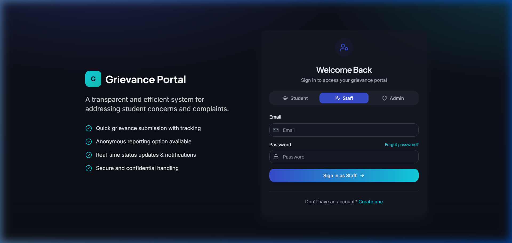
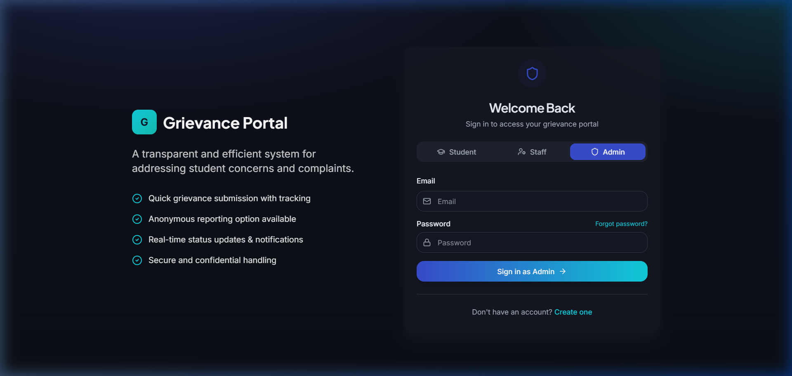
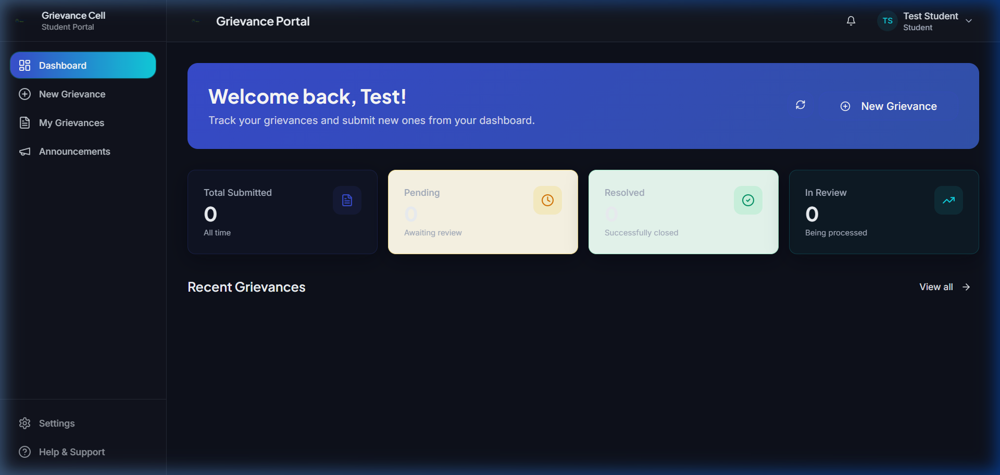
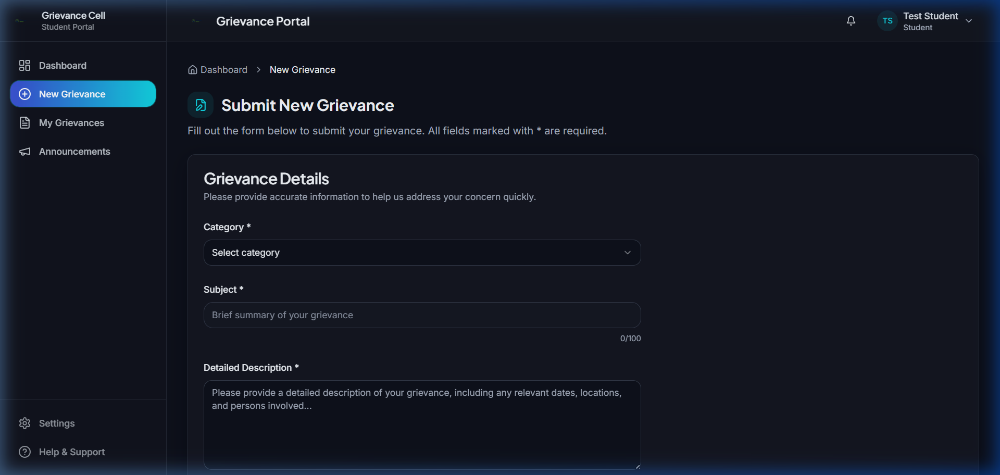
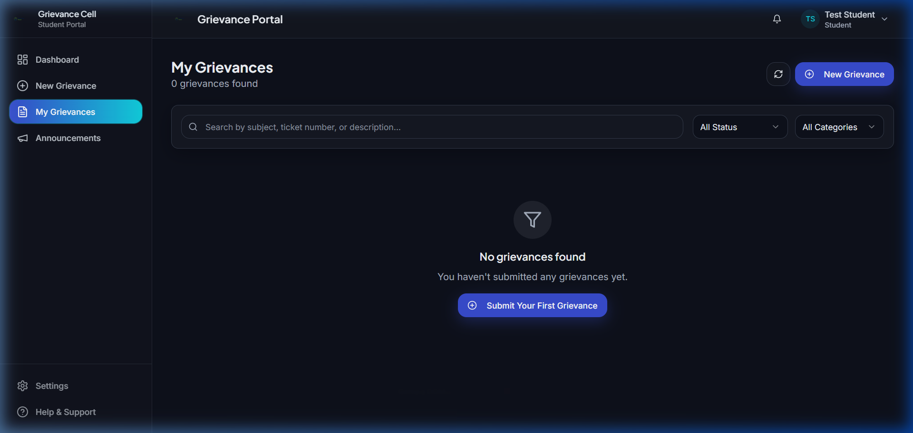
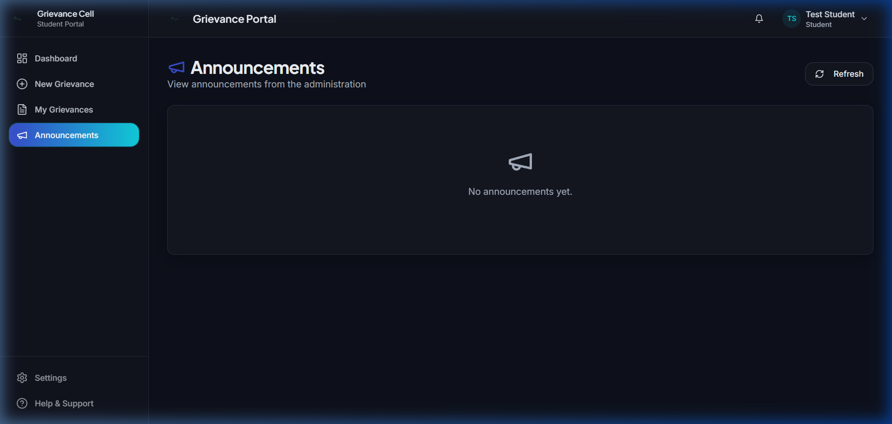

# Grievance Management System — Engineering College

> A digital platform for students, faculty, and administration to raise, track, and resolve institutional grievances efficiently.


---

## Overview

The **Grievance Management System** is an academic project developed specifically for engineering college environments. It replaces traditional manual and paper-based grievance handling with a structured, transparent, and multi-tier digital workflow between **Students**, **Faculty/Staff**, and the **Principal**.

The platform streamlines complaint submission, progress tracking, department-level assignment, automated SLA escalation, and institutional announcement publishing, ensuring timely resolution and accountability across campus departments.

---

## 🎥 Demo

Here is a quick walkthrough of the application workflow across all user roles:

```
+-----------------------------------------------------------------------------------+
|                            GRIEVANCE RESOLUTION WORKFLOW                          |
+-----------------------------------------------------------------------------------+
|  [Student]                  [Faculty / HOD]                    [Principal]        |
|     |                             |                                 |             |
|     |-- 1. Submit Grievance ----->|                                 |             |
|     |   (Category, Attachments)   |-- 2. Review & Resolve --------->|             |
|     |                             |   (Update Status, Comment)      |             |
|     |<-- 4. Real-time Status -----|                                 |-- 3. Final  |
|     |    Updates                  |<-- SLA Escalation (If Delayed)--|   Oversight |
+-----------------------------------------------------------------------------------+
```

---

## 📸 Screenshots

### Login Portal

*Multi-role login portal with Student, Staff, and Admin tabs — role switches in-place without navigating away.*

| Student Login | Staff Login | Admin / Principal Login |
|:---:|:---:|:---:|
|  |  |  |

---

### Student Portal

*Students can track, submit, and browse grievances and announcements from a unified dashboard.*

| Student Dashboard | Submit New Grievance |
|:---:|:---:|
|  |  |

| My Grievances (Status Tracking) | Campus Announcements |
|:---:|:---:|
|  |  |

---

## Key Features

- **Student Grievance Submission & Tracking**
  - Easily submit grievances with department selection, category classification, priority levels, and document/image attachments.
  - Track real-time ticket statuses (`Pending`, `In Progress`, `Resolved`, `Escalated`).

- **Multi-tier Resolution Workflow**
  - Department-level routing to designated Faculty In Charge, Head of Department (HOD), or System Administrators.
  - Interactive discussion thread per grievance for clear communication between students and staff.

- **Automated Escalation System**
  - Time-sensitive SLA monitoring that automatically escalates delayed grievances to higher administration levels (e.g., Principal oversight).

- **Principal Administration & Staff Management**
  - Review and process pending staff registration requests.
  - **Account Suspension & Reactivation**: Principal can suspend or unsuspend staff accounts to control system access with immediate enforcement at login.

- **Targeted Campus Announcements**
  - Publish announcements directed at specific audiences (`Students`, `Faculty / Staff`, `Both`, `Everyone`) combined with multi-department selection filtering.

- **Interactive Analytics & Dashboards**
  - Visual charts (powered by Recharts) showing grievance volume trends, category breakdowns, resolution rates, and departmental response times.

- **Role-Based Security**
  - Multi-role authentication (Student, Staff/Faculty, Admin/Principal) powered by JWT tokens and secure password hashing.

---

## Tech Stack

### Frontend
- **Framework & Language**: React 18, TypeScript, Vite
- **Styling**: Vanilla CSS & Tailwind CSS with Tailwind Animate
- **UI Components**: Radix UI Primitives, Lucide React Icons
- **State & Query**: React Context API, TanStack React Query
- **Charts & Data**: Recharts, Date-fns, Sonner Toast Notifications

### Backend & Database
- **Server Language**: PHP 8.x (RESTful API architecture)
- **Database Abstraction**: PHP Data Objects (PDO) with prepared SQL statements
- **Database Engine**: MySQL / MariaDB (`campus_relief_db`)
- **Authentication**: Custom JWT (JSON Web Token) implementation with bcrypt password hashing

---

## Installation & Setup

### Prerequisites
- [Node.js](https://nodejs.org/) (v18 or higher)
- [XAMPP](https://www.apachefriends.org/) (or any local web server with Apache and MySQL/MariaDB)
- [Git](https://git-scm.com/)

### 1. Clone the Repository
```bash
git clone https://github.com/abhinand-03/Grievance-Management-System.git
cd Grievance-Management-System
```

### 2. Database Setup
1. Start **Apache** and **MySQL** services in the XAMPP Control Panel.
2. Open phpMyAdmin (`http://localhost/phpmyadmin`).
3. Import the SQL database schemas:
   - Import `database/campus_relief_v2.sql` to create `campus_relief_db` and tables.
   - Import `database/add_announcements.sql` for announcements and notification structures.

### 3. Backend Configuration
Move or symlink the project folder into your XAMPP web root directory:
```
C:\xampp\htdocs\Grievance Management System
```
The PHP API endpoints will automatically serve under `http://localhost/Grievance Management System/api/`.

### 4. Install Frontend Dependencies
```bash
npm install
```

### 5. Run the Application
```bash
cmd /c npm run dev
```
Open your browser and navigate to `http://localhost:8080/`.

---

## Roadmap / Work in Progress

This project is under active development as part of ongoing academic work. Planned improvements include:

- [ ] **Email & SMS Notification Service**: Integration with SMTP/PHPMailer and SMS gateways for instant escalation alerts.
- [ ] **AI-Assisted Classification**: Automated NLP model to categorize incoming grievances and recommend priority tags.
- [ ] **Mobile Application**: Cross-platform mobile app built with React Native / Progressive Web App (PWA) support.
- [ ] **Institutional Audit Reports**: Automated PDF generation for NAAC / NBA institutional accreditation compliance audits.

---

## Academic Context

This project was developed as part of an academic project aimed at digitizing and streamlining the grievance redressal process within an engineering college environment.

---

## License & Contact

Distributed under the **MIT License**. See `LICENSE` for more information.

- **Author**: Abhinand (`@abhinand-03`)
- **Repository**: [https://github.com/abhinand-03/Grievance-Management-System](https://github.com/abhinand-03/Grievance-Management-System)
